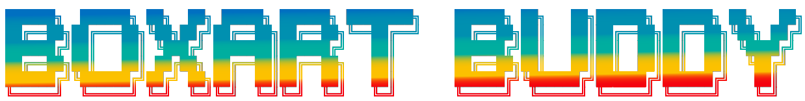
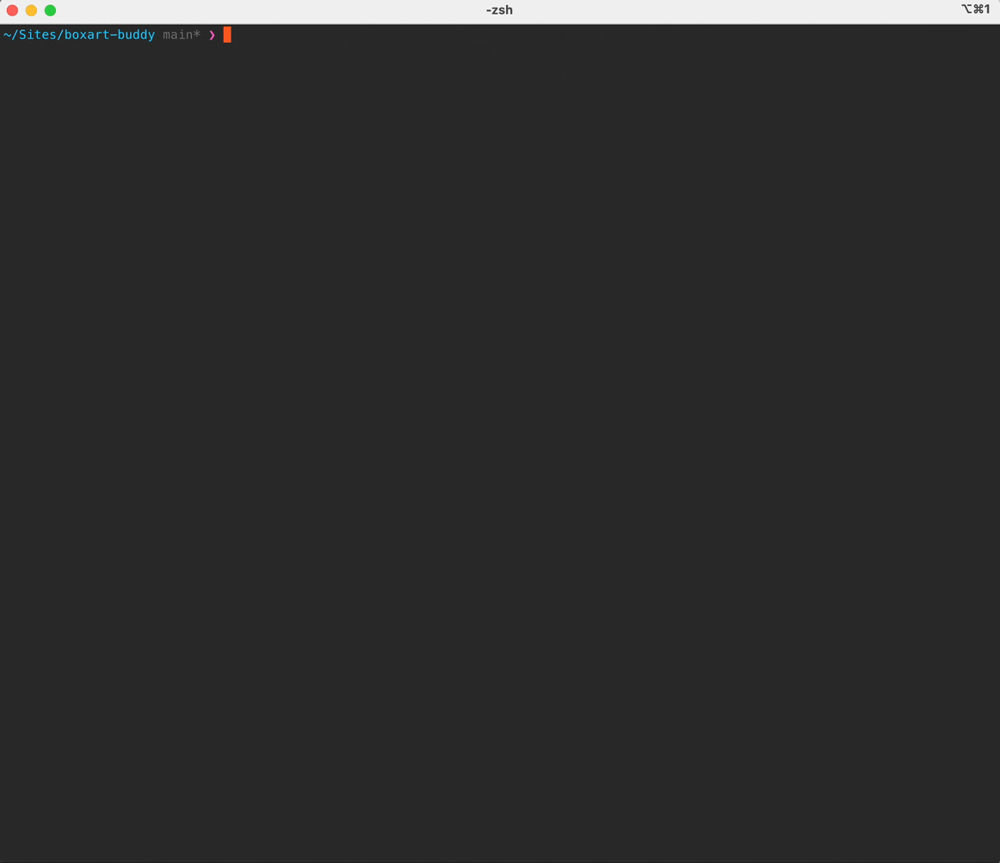

  <a href="https://github.com/boxart-buddy/boxart-buddy">
    <h3 align="center"></h3>
  </a>

  

    Boxart Buddy is a command line application written in PHP that helps to generate artwork for SBC Gaming & Retro Handlhelds in conjunction with <a href="https://github.com/Gemba/Skyscraper/">Skyscraper</a>. This early version is desgined to work with <a href="https://muos.dev/help/artwork">MUOS</a> and devices like the ANBERNIC RG35XX/Plus/H/SP
  

 

 

<!-- Intro -->

## Preamble

Boxart Buddy is still under heavy development and is unstable and subject to change prior to the 1.0 release. In
time I hope to improve the docs and installation process.

