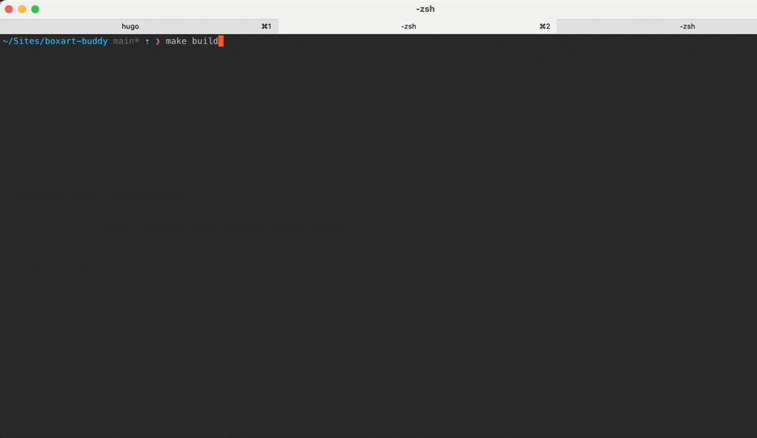


All commands should be run from the root of the boxart-buddy repository


{}

### Bootstrap

```shell
make bootstrap
```

This will generate config files inside ./user_config folder.











You must edit ```config.yml``` and ```config_platform.yml``` before you can proceed.
See [Configuration Reference]( ) for more details


You can also run ```make bootstrap-tinybest``` or ```make bootstrap-done2``` if you are using those romsets. This will
create ```config_platform.yml``` preconfigured for those romsets.


### Scrape

```shell
make scrape
```

This will take a while (depending on the number of roms you have).

### Generate

```shell
make build
```



Completed artwork will be output into ```./package```


After generating, some roms may be skipped due to not being scraped properly.
See the [skipped section]() for how to handle this


{}
