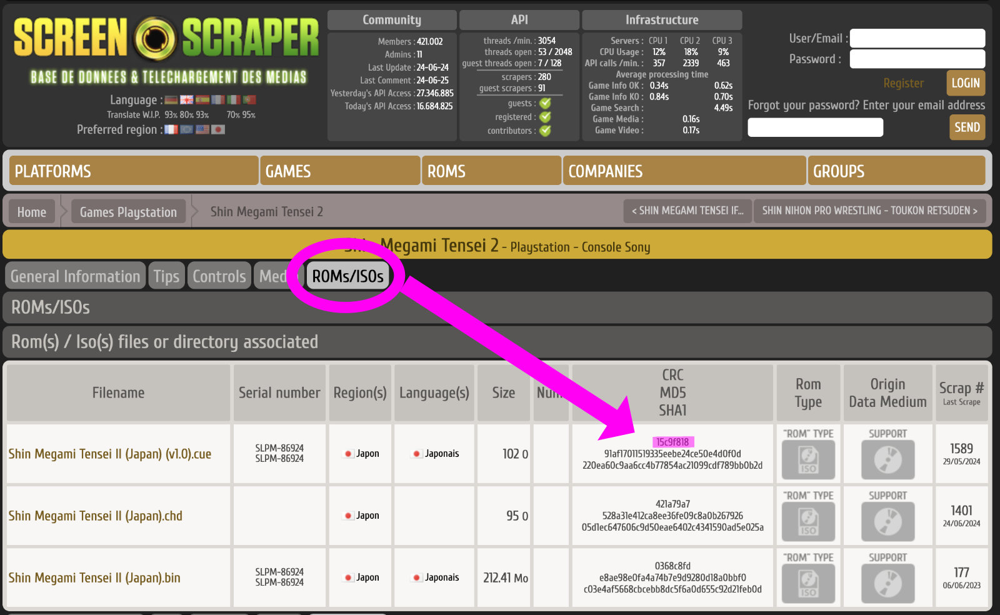

### missing.json

During the scraping process some of your roms may not be able to be matched e.g fan made translations,
rom hacks or if the filename can't be matched.

Skyscraper already generates log files for these missing files. boxart-buddy uses these files to streamline the process
of re-scraping for those roms that are missing.

After the scraping, all roms that cannot be found will be added to a single file









```json {filename="missing.json"}
{
  "romname.zip": {
    "platform": "megadrive",
    "query": "crc="
  },
  "romname2.zip": {
    "platform": "gamegear",
    "query": "crc="
  }
}
```

You can fill this in to provide a 'crc' to target a specific game, or change the 'query' string as follows to try and
match on 'name' instead e.g

```json {filename="missing.json"}
{
  "Rhythm Heaven Silver (Japan) (Translated).zip": {
    "platform": "gba",
    "query": "crc=349D7025"
  },
  "Go for it! Goemon 3 - The Mecha Leg Hold of Jurokube Shishi (Japan) (Translated).zip": {
    "platform": "snes",
    "query": "romnom=Ganbare Goemon 3"
  },
  "Mystery Dungeon 2 - Shiren the Wanderer (Japan) (Translated).zip": {
    "platform": "snes",
    "query": "romnom=Fushigi No Dungeon 2"
  }
}
```

You can get the CRC of a game from the ROMs/ISOs tab.



### Scraping using missing.json

Once complete you can run a command to parse this file and rescrape these roms, hopefully filling the cache for all your
roms.

To scrape using the file run:

``` shell
make scrape-skipped
```

After running the ```missing.json``` file will be backed up to the folder ```./skipped/processed/```

### Sample

This is an example of 'missing.json' that could be useful if you have a particular set of roms. To use it move it
to ```./skipped/romset/missing.json``` and run the above command.

[tinybest_missing.json](  )
